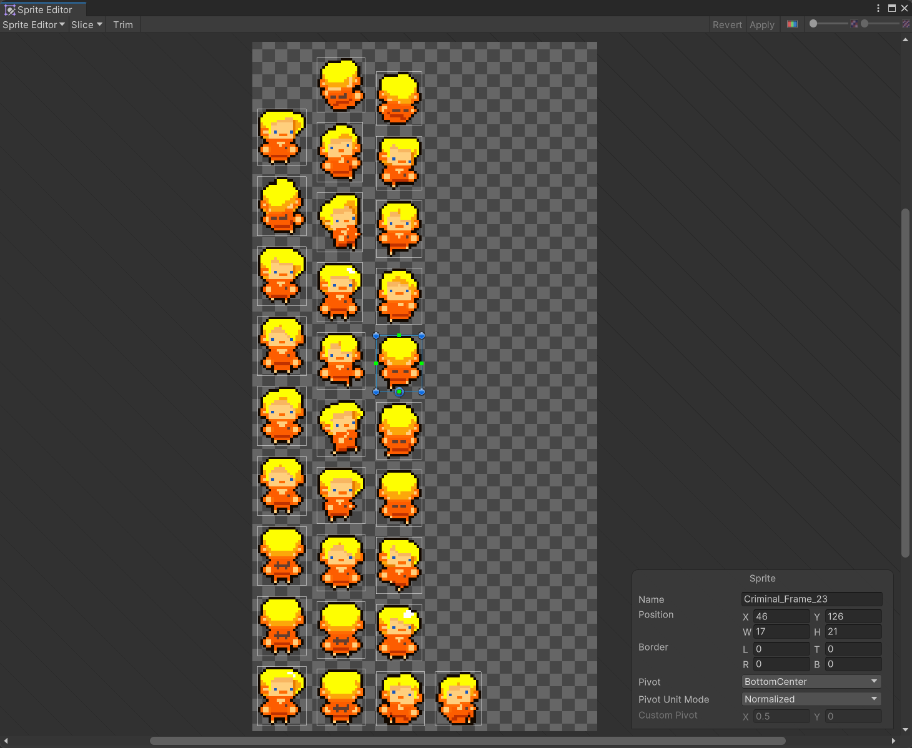
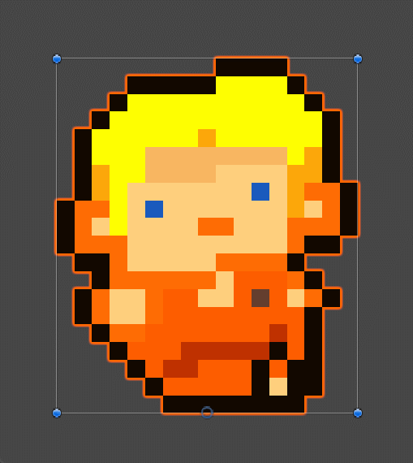
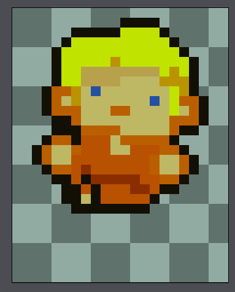
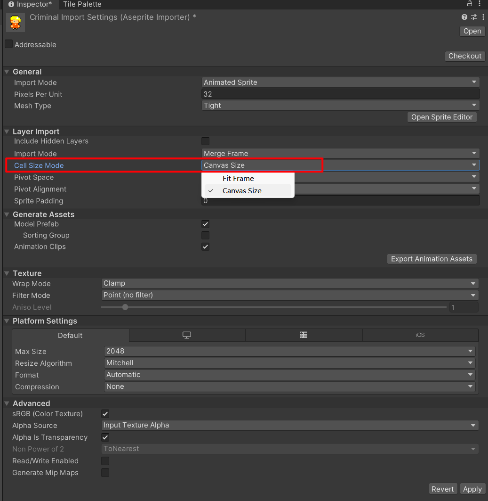
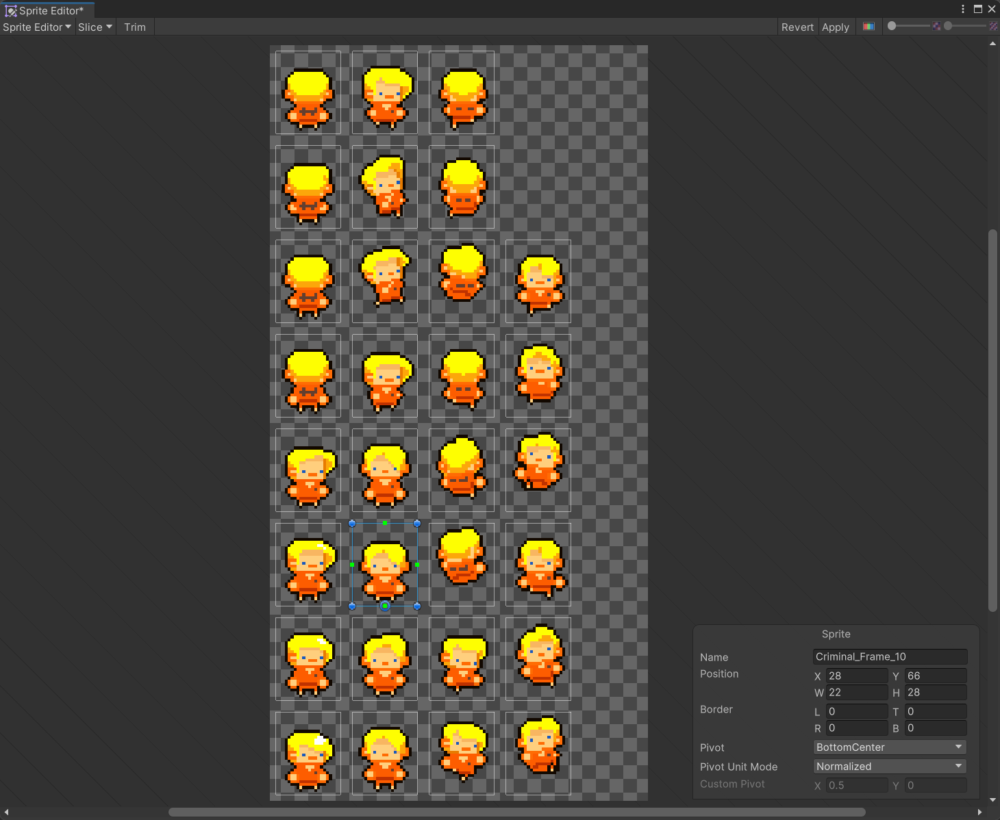

# Aseprite Importer

## Description

Adapted from the official [Aseprite Importer package (ver. 1.0.1)]([Introduction to Aseprite Importer | 2D Aseprite Importer | 1.1.0 (unity3d.com)](https://docs.unity3d.com/Packages/com.unity.2d.aseprite@1.1/manual/index.html)). Support importing images and animations using the original canvas size.

### Official Version

The official version imports sprites with theirs own size:

Therefore the imported animations are so different from the original animation in Aseprite. The animation is completely distorted and expressionless!

- Preview `Run_Down` Animation in ***Unity***:

- Original `Run_Down` Animation in ***Aseprite***:

  

### My Custom Version

In my version, there is a new option called `Cell Size Mode`:

Select `Canvas Size` option and you will get correct frame size:

## How To Use

1. Clone this repository, copy folder `com.unity.2d.aseprite@1.0.1` to folder `<YourUnityProjectRoot>/Packages`.

2. Select your `*.ase` file, find `Cell Size Mode` option and change to `Canvas Size`.
3. Click `Apply` button on the bottom right corner in Inspector.
